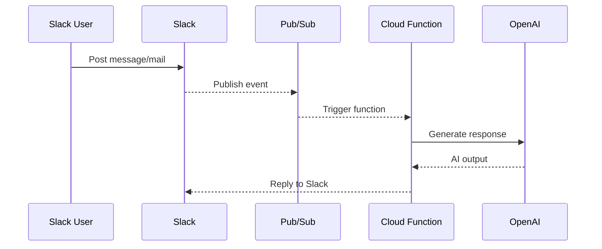

# Slack Sub Bot

[](https://deepwiki.com/bulldra/slack-sub-bot)

A Slack bot that leverages generative AI to summarize links, handle emails and answer user questions.

## Setup

1. Install dependencies

```bash
pip install -r src/requirements.txt
```

2. Prepare environment variables

Set the `SECRETS` environment variable with a JSON string containing:
`SLACK_BOT_TOKEN`, `SLACK_USER_TOKEN`, `OPENAI_API_KEY` and other tokens used by the bot.

Example:

```bash
export SECRETS='{"SLACK_BOT_TOKEN":"xoxb-...","SLACK_USER_TOKEN":"xoxp-...","OPENAI_API_KEY":"sk-..."}'
```

### GitHub Actions

For tests running on GitHub Actions, store the same JSON string in a repository
secret named `SECRETS_JSON`. The `test.yml` workflow writes this value to
`secrets.json` before executing `pytest`.

3. Run tests

```bash
pytest
```

## Usage

Deploy the Cloud Function using `deploy.sh`, or deploy as a Cloud Run service with `deploy_cloudrun.sh`. Deployment can also be automated through the GitHub Actions workflows. The deployment workflows run automatically after the test workflow succeeds. You can invoke it locally with `functions-framework`:

```bash
functions-framework --target main --signature-type cloudevent
```

Publish a Pub/Sub message with the following format:

```json
{
  "context": {"channel": "C123", "user_id": "U123"},
  "chat_history": [{"role": "user", "content": "https://example.com"}]
}
```

The bot detects URLs or commands from the message, generates a reply with OpenAI and posts the result back to Slack.

## Sequence Diagram



